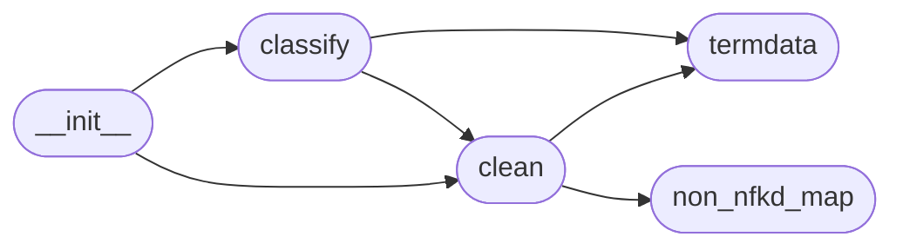

# Code Overview

[_Documentation generated by Documatic_](https://www.documatic.com)

<!---Documatic-section-Codebase Structure Python-start--->
## Codebase Structure Python

The codebase has a flat structure, with 5 code files.

<!---Documatic-block-system_architecture-start--->

<!---Documatic-block-system_architecture-end--->

# #
<!---Documatic-section-Codebase Structure Python-end--->

<!---Documatic-section-Key Objects-start--->
## Key Objects

There are exposed imports at level-0
from the source directory (cleanco)

<!---Documatic-block-cleanco-start--->

	
<code>cleanco</code> (Click to Expand!)

* `cleanco.classify.countrysources`
* `cleanco.classify.matches`
* `cleanco.classify.typesources`
* `cleanco.clean.basename`
* `cleanco.clean.prepare_default_terms`

<!---Documatic-block-cleanco-end--->

# #
<!---Documatic-section-Key Objects-end--->

<!---Documatic-section-Important Functions-start--->
## Important Functions

<!---Documatic-block-important_funcs-start--->
<!---Documatic-block-most_used_funcs-start--->
### Most Utilised Functions

* cleanco.termdata.terms_by_country (2 times)
* cleanco.termdata.terms_by_type (2 times)
* [cleanco.clean.strip_tail](4-cleanco_clean.md#cleanco.clean.strip_tail) (1 times)
* [cleanco.clean.normalized](4-cleanco_clean.md#cleanco.clean.normalized) (1 times)
* [cleanco.clean.prepare_default_terms](4-cleanco_clean.md#cleanco.clean.prepare_default_terms) (1 times)
* cleanco.clean.basename (1 times)
* [cleanco.classify.typesources](3-cleanco_classify.md#cleanco.classify.typesources) (1 times)
* [cleanco.classify.countrysources](3-cleanco_classify.md#cleanco.classify.countrysources) (1 times)
* [cleanco.classify.matches](3-cleanco_classify.md#cleanco.classify.matches) (1 times)
<!---Documatic-block-most_used_funcs-end--->

<!---Documatic-block-end_user_funcs-start--->
### End User Exposed Functions

* [cleanco.classify.matches](3-cleanco_classify.md#cleanco.classify.matches)
* [cleanco.clean.prepare_default_terms](4-cleanco_clean.md#cleanco.clean.prepare_default_terms)
* cleanco.clean.basename
* [cleanco.classify.typesources](3-cleanco_classify.md#cleanco.classify.typesources)
* [cleanco.classify.countrysources](3-cleanco_classify.md#cleanco.classify.countrysources)
<!---Documatic-block-end_user_funcs-end--->
<!---Documatic-block-important_funcs-end--->

# #
<!---Documatic-section-Important Functions-end--->

[_Documentation generated by Documatic_](https://www.documatic.com)