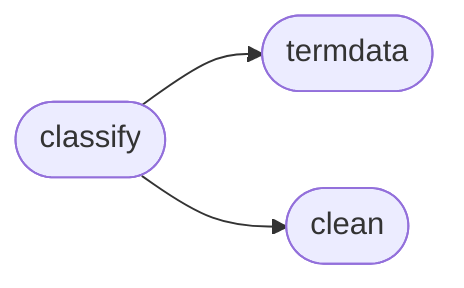

# Cleanco Classify

[_Documentation generated by Documatic_](https://www.documatic.com)

<!---Documatic-section-Codebase Structure-start--->
## Codebase Structure

<!---Documatic-block-system_architecture-start--->

<!---Documatic-block-system_architecture-end--->

# #
<!---Documatic-section-Codebase Structure-end--->

<!---Documatic-section-cleanco.classify.typesources-start--->
## [cleanco.classify.typesources](3-cleanco_classify.md#cleanco.classify.typesources)

<!---Documatic-section-typesources-start--->
<!---Documatic-block-cleanco.classify.typesources-start--->
<details>
	<summary><code>cleanco.classify.typesources</code> code snippet</summary>

```python
def typesources():
    types = []
    for business_type in terms_by_type:
        for item in terms_by_type[business_type]:
            types.append((business_type, item))
    return sorted(types, key=lambda part: len(part[1]), reverse=True)
```
</details>
<!---Documatic-block-cleanco.classify.typesources-end--->
<!---Documatic-section-typesources-end--->

# #
<!---Documatic-section-cleanco.classify.typesources-end--->

<!---Documatic-section-cleanco.classify.countrysources-start--->
## [cleanco.classify.countrysources](3-cleanco_classify.md#cleanco.classify.countrysources)

<!---Documatic-section-countrysources-start--->
<!---Documatic-block-cleanco.classify.countrysources-start--->
<details>
	<summary><code>cleanco.classify.countrysources</code> code snippet</summary>

```python
def countrysources():
    countries = []
    for country in terms_by_country:
        for item in terms_by_country[country]:
            countries.append((country, item))
    return sorted(countries, key=lambda part: len(part[1]), reverse=True)
```
</details>
<!---Documatic-block-cleanco.classify.countrysources-end--->
<!---Documatic-section-countrysources-end--->

# #
<!---Documatic-section-cleanco.classify.countrysources-end--->

<!---Documatic-section-cleanco.classify.matches-start--->
## [cleanco.classify.matches](3-cleanco_classify.md#cleanco.classify.matches)

<!---Documatic-section-matches-start--->


### Object Calls

* [cleanco.clean.strip_tail](4-cleanco_clean.md#cleanco.clean.strip_tail)
* [cleanco.clean.normalized](4-cleanco_clean.md#cleanco.clean.normalized)

<!---Documatic-block-cleanco.classify.matches-start--->
<details>
	<summary><code>cleanco.classify.matches</code> code snippet</summary>

```python
def matches(name, sources):
    name = strip_tail(name)
    parts = name.split()
    nparts = [normalized(p) for p in parts]
    matches = []
    for (classifier, term) in sources:
        nterm = normalized(term)
        try:
            idx = nparts.index(nterm)
        except ValueError:
            pass
        else:
            matches.append(classifier)
    return matches
```
</details>
<!---Documatic-block-cleanco.classify.matches-end--->
<!---Documatic-section-matches-end--->

# #
<!---Documatic-section-cleanco.classify.matches-end--->

[_Documentation generated by Documatic_](https://www.documatic.com)