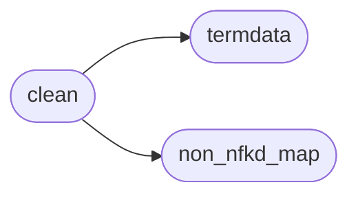
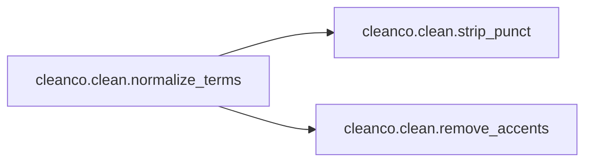
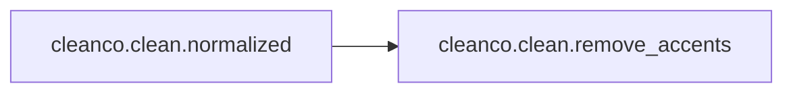
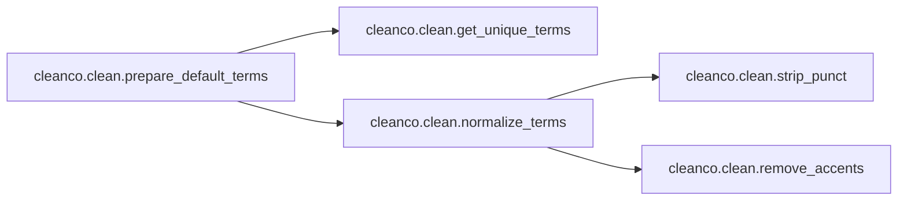
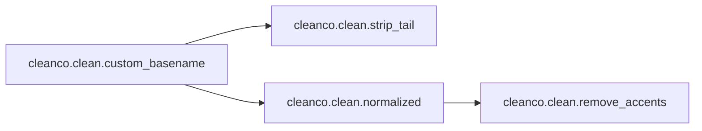

# Cleanco Clean

[_Documentation generated by Documatic_](https://www.documatic.com)

<!---Documatic-section-Codebase Structure-start--->
## Codebase Structure

<!---Documatic-block-system_architecture-start--->

<!---Documatic-block-system_architecture-end--->

# #
<!---Documatic-section-Codebase Structure-end--->

<!---Documatic-section-cleanco.clean.get_unique_terms-start--->
## [cleanco.clean.get_unique_terms](4-cleanco_clean.md#cleanco.clean.get_unique_terms)

<!---Documatic-section-get_unique_terms-start--->
<!---Documatic-block-cleanco.clean.get_unique_terms-start--->
<details>
	<summary><code>cleanco.clean.get_unique_terms</code> code snippet</summary>

```python
def get_unique_terms():
    ts = functools.reduce(operator.iconcat, terms_by_type.values(), [])
    cs = functools.reduce(operator.iconcat, terms_by_country.values(), [])
    return set(ts + cs)
```
</details>
<!---Documatic-block-cleanco.clean.get_unique_terms-end--->
<!---Documatic-section-get_unique_terms-end--->

# #
<!---Documatic-section-cleanco.clean.get_unique_terms-end--->

<!---Documatic-section-cleanco.clean.remove_accents-start--->
## [cleanco.clean.remove_accents](4-cleanco_clean.md#cleanco.clean.remove_accents)

<!---Documatic-section-remove_accents-start--->
<!---Documatic-block-cleanco.clean.remove_accents-start--->
<details>
	<summary><code>cleanco.clean.remove_accents</code> code snippet</summary>

```python
def remove_accents(t):
    nfkd_form = unicodedata.normalize('NFKD', t.casefold())
    return ''.join((NON_NFKD_MAP[c] if c in NON_NFKD_MAP else c for part in nfkd_form for c in part if unicodedata.category(part) != 'Mn'))
```
</details>
<!---Documatic-block-cleanco.clean.remove_accents-end--->
<!---Documatic-section-remove_accents-end--->

# #
<!---Documatic-section-cleanco.clean.remove_accents-end--->

<!---Documatic-section-cleanco.clean.strip_punct-start--->
## [cleanco.clean.strip_punct](4-cleanco_clean.md#cleanco.clean.strip_punct)

<!---Documatic-section-strip_punct-start--->
<!---Documatic-block-cleanco.clean.strip_punct-start--->
<details>
	<summary><code>cleanco.clean.strip_punct</code> code snippet</summary>

```python
def strip_punct(t):
    return t.replace('.', '').replace(',', '').replace('-', '')
```
</details>
<!---Documatic-block-cleanco.clean.strip_punct-end--->
<!---Documatic-section-strip_punct-end--->

# #
<!---Documatic-section-cleanco.clean.strip_punct-end--->

<!---Documatic-section-cleanco.clean.normalize_terms-start--->
## [cleanco.clean.normalize_terms](4-cleanco_clean.md#cleanco.clean.normalize_terms)

<!---Documatic-section-normalize_terms-start--->


### Object Calls

* [cleanco.clean.strip_punct](4-cleanco_clean.md#cleanco.clean.strip_punct)
* [cleanco.clean.remove_accents](4-cleanco_clean.md#cleanco.clean.remove_accents)

<!---Documatic-block-cleanco.clean.normalize_terms-start--->
<details>
	<summary><code>cleanco.clean.normalize_terms</code> code snippet</summary>

```python
def normalize_terms(terms):
    return (strip_punct(remove_accents(t)) for t in terms)
```
</details>
<!---Documatic-block-cleanco.clean.normalize_terms-end--->
<!---Documatic-section-normalize_terms-end--->

# #
<!---Documatic-section-cleanco.clean.normalize_terms-end--->

<!---Documatic-section-cleanco.clean.strip_tail-start--->
## [cleanco.clean.strip_tail](4-cleanco_clean.md#cleanco.clean.strip_tail)

<!---Documatic-section-strip_tail-start--->
<!---Documatic-block-cleanco.clean.strip_tail-start--->
<details>
	<summary><code>cleanco.clean.strip_tail</code> code snippet</summary>

```python
def strip_tail(name):
    match = re.search(tail_removal_rexp, name)
    if match is not None:
        name = name[:match.span()[0]]
    return name
```
</details>
<!---Documatic-block-cleanco.clean.strip_tail-end--->
<!---Documatic-section-strip_tail-end--->

# #
<!---Documatic-section-cleanco.clean.strip_tail-end--->

<!---Documatic-section-cleanco.clean.normalized-start--->
## [cleanco.clean.normalized](4-cleanco_clean.md#cleanco.clean.normalized)

<!---Documatic-section-normalized-start--->


### Object Calls

* [cleanco.clean.remove_accents](4-cleanco_clean.md#cleanco.clean.remove_accents)

<!---Documatic-block-cleanco.clean.normalized-start--->
<details>
	<summary><code>cleanco.clean.normalized</code> code snippet</summary>

```python
def normalized(text):
    return remove_accents(text)
```
</details>
<!---Documatic-block-cleanco.clean.normalized-end--->
<!---Documatic-section-normalized-end--->

# #
<!---Documatic-section-cleanco.clean.normalized-end--->

<!---Documatic-section-cleanco.clean.prepare_default_terms-start--->
## [cleanco.clean.prepare_default_terms](4-cleanco_clean.md#cleanco.clean.prepare_default_terms)

<!---Documatic-section-prepare_default_terms-start--->


### Object Calls

* [cleanco.clean.get_unique_terms](4-cleanco_clean.md#cleanco.clean.get_unique_terms)
* [cleanco.clean.normalize_terms](4-cleanco_clean.md#cleanco.clean.normalize_terms)

<!---Documatic-block-cleanco.clean.prepare_default_terms-start--->
<details>
	<summary><code>cleanco.clean.prepare_default_terms</code> code snippet</summary>

```python
def prepare_default_terms():
    terms = get_unique_terms()
    nterms = normalize_terms(terms)
    ntermparts = (t.split() for t in nterms)
    sntermparts = sorted(ntermparts, key=lambda x: (-len(x), x))
    return [(len(tp), tp) for tp in sntermparts]
```
</details>
<!---Documatic-block-cleanco.clean.prepare_default_terms-end--->
<!---Documatic-section-prepare_default_terms-end--->

# #
<!---Documatic-section-cleanco.clean.prepare_default_terms-end--->

<!---Documatic-section-cleanco.clean.custom_basename-start--->
## [cleanco.clean.custom_basename](4-cleanco_clean.md#cleanco.clean.custom_basename)

<!---Documatic-section-custom_basename-start--->


### Object Calls

* [cleanco.clean.strip_tail](4-cleanco_clean.md#cleanco.clean.strip_tail)
* [cleanco.clean.normalized](4-cleanco_clean.md#cleanco.clean.normalized)

<!---Documatic-block-cleanco.clean.custom_basename-start--->
<details>
	<summary><code>cleanco.clean.custom_basename</code> code snippet</summary>

```python
def custom_basename(name, terms, suffix=True, prefix=False, middle=False, **kwargs):
    name = strip_tail(name)
    nparts = name.split()
    nname = normalized(name)
    nnparts = list(map(strip_punct, nname.split()))
    nnsize = len(nnparts)
    if suffix:
        for (termsize, termparts) in terms:
            if nnparts[-termsize:] == termparts:
                del nnparts[-termsize:]
                del nparts[-termsize:]
    if prefix:
        for (termsize, termparts) in terms:
            if nnparts[:termsize] == termparts:
                del nnparts[:termsize]
                del nparts[:termsize]
    if middle:
        for (termsize, termparts) in terms:
            if termsize > 1:
                sizediff = nnsize - termsize
                if sizediff > 1:
                    for i in range(0, nnsize - termsize + 1):
                        if termparts == nnparts[i:i + termsize]:
                            del nnparts[i:i + termsize]
                            del nparts[i:i + termsize]
            elif termparts[0] in nnparts[1:-1]:
                idx = nnparts[1:-1].index(termparts[0])
                del nnparts[idx + 1]
                del nparts[idx + 1]
    return strip_tail(' '.join(nparts))
```
</details>
<!---Documatic-block-cleanco.clean.custom_basename-end--->
<!---Documatic-section-custom_basename-end--->

# #
<!---Documatic-section-cleanco.clean.custom_basename-end--->

[_Documentation generated by Documatic_](https://www.documatic.com)